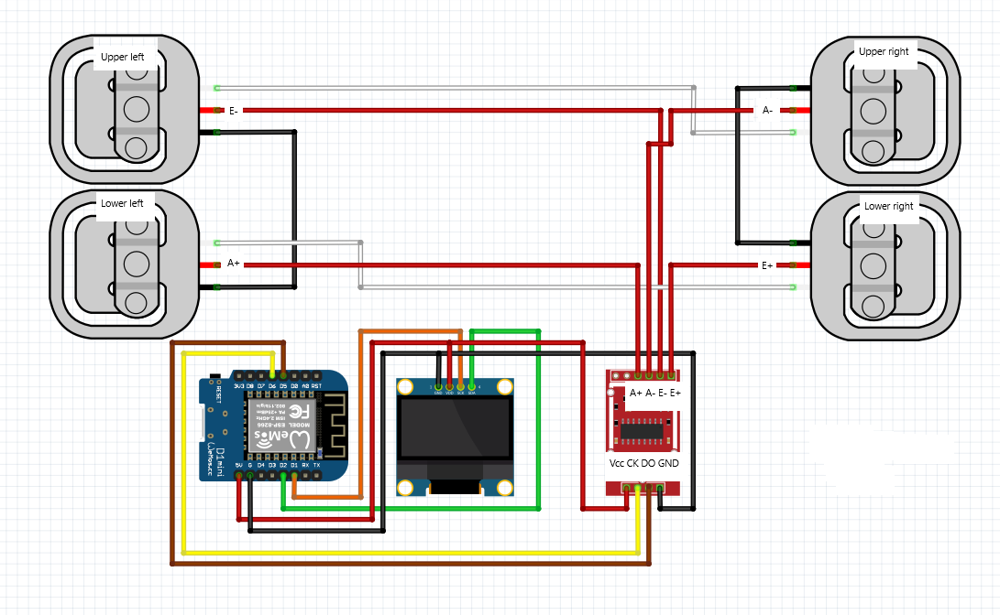

# BeerScale
 
<b>Delar:</b> 
    Våg: https://www.jula.se/catalog/hem-och-hushall/personvard-och-halsa/halsa-och-massage/personvagar/personvag-005043/ 
    Alternativt lösa viktelement och bygga en egen ram. I det här kittet så ingår det en hx711 modul: https://www.banggood.com/4pcs-DIY-50KG-Body-Load-Cell-Weight-Strain-Sensor-Resistance-With-HX711-AD-Module-p-1326815.html?rmmds=search&cur_warehouse=CN 
  
    OLED skärm: https://pchbutik.se/kretskort/830-oled-display-096-tummed-128x64-vita-pixlar-i2c-ssd1306.html?search_query=1316&results=1  
    HX711 ADC viktmodul: https://pchbutik.se/nytt-pa-lager/967-modul-till-vikt-sensor-hx711-adc.html?search_query=0391&results=1  
    Wemos D1 mini: https://pchbutik.se/nytt-pa-lager/1179-esp8266-esp-12-usb-wemos-d1-mini-wifi-development-board-d1-mini-nodemc.html?search_query=wemos+d1&results=44  
  
<b>Kopplingschema:</b>
    
 
