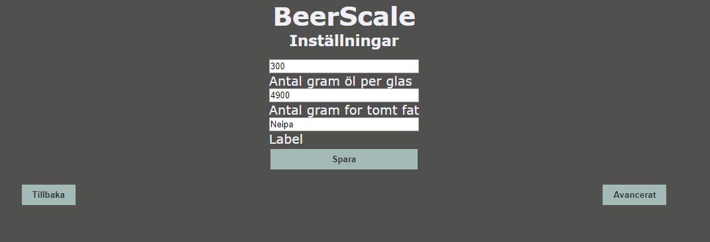

# BeerScale

 
<b>Delar:</b> 
    Våg: <a href="https://www.jula.se/catalog/hem-och-hushall/personvard-och-halsa/halsa-och-massage/personvagar/personvag-005043/">https://www.jula.se/catalog/hem-och-hushall/personvard-och-halsa/halsa-och-massage/personvagar/personvag-005043/</a> 
    Alternativt lösa viktelement och bygga en egen ram. I det här kittet så ingår det en hx711 modul: <a href="https://www.banggood.com/4pcs-DIY-50KG-Body-Load-Cell-Weight-Strain-Sensor-Resistance-With-HX711-AD-Module-p-1326815.html?rmmds=search&cur_warehouse=CN">https://www.banggood.com/4pcs-DIY-50KG-Body-Load-Cell-Weight-Strain-Sensor-Resistance-With-HX711-AD-Module-p-1326815.html?rmmds=search&cur_warehouse=CN</a> 
  
    OLED skärm: <a href="https://pchbutik.se/kretskort/830-oled-display-096-tummed-128x64-vita-pixlar-i2c-ssd1306.html?search_query=1316&results=1">https://pchbutik.se/kretskort/830-oled-display-096-tummed-128x64-vita-pixlar-i2c-ssd1306.html?search_query=1316&results=1 </a> 
    HX711 ADC viktmodul: <a href="https://pchbutik.se/nytt-pa-lager/967-modul-till-vikt-sensor-hx711-adc.html?search_query=0391&results=1">https://pchbutik.se/nytt-pa-lager/967-modul-till-vikt-sensor-hx711-adc.html?search_query=0391&results=1</a>  
    Wemos D1 mini: <a href="https://pchbutik.se/nytt-pa-lager/1179-esp8266-esp-12-usb-wemos-d1-mini-wifi-development-board-d1-mini-nodemc.html?search_query=wemos+d1&results=44">https://pchbutik.se/nytt-pa-lager/1179-esp8266-esp-12-usb-wemos-d1-mini-wifi-development-board-d1-mini-nodemc.html?search_query=wemos+d1&results=44 </a> 
  
<b>Hårdvara:</b> 
    Jag använde mig av jula vågen som jag kapade ner till lite mindre storlek för att den skulle få plats i min kylbox. jag ersatte orginal glasskivan med en gammal spegel som jag hade liggandes. 
     
    I jula vågen så rensar man ut befintligt kretskort och ersätter det med HX711 ADC modulen. 
    [Todo] Bild på koppling i vågen...   
    Allt kopplas enligt schemat: 
      
    Vill man ha en tunn smidig installation så kan man sätta portarna vdd och sck ifrån oled skärmen direkt på wemos d1 
     
     

 
<b>Installation av mjukvara:</b> 
    Om man inte vill kompilera själv så går det att ladda ner firmware filen BeerScale_V1.0.bin
    och med hjälp av en dator och <a href="https://github.com/nodemcu/nodemcu-flasher"> ESP8266Flasher</a> 
     
    [todo]vad behövs i arduino.... 
     
<b> Första uppstart och kalibrering:</b> 
    I v1.0 så måste man ansluta enheten till ett wifi (2.4ghz) nät. I nästa version så kommer det vara valbart. 
    När man startar upp enheten första gången så startas enheten i ett AP mode. man behöver du ansluta med en dator eller telefon direkt till enhetens wifi nät (BeerscaleAP). Skriv in addressen http://192.168.1.4 i en webbläsare på datorn eller telefonen som du har anslutit med. Du kommer få upp ett gränssnitt för att ansluta enheten till ditt befintliga wifi nät. 
    När detta är gjort så ska enheten startas om och automatiskt ansluta till ditt wifi nät.  
     
    Du behöver nu ansluta till enhetens webbgränsitt för att göra en kalibrering av vågen. 
    För att hitta enhetens ip address så kan man kolla i tex routern eller köra något ip scaningsprogram som tex <a herf="https://angryip.org/">Angry ip scanner</a>  
      
    Börja med att ta ut ett nollvärde. Du ska inte ha någon vikt på vågen när detta görs. Gå till inställningar>avancerat och tryck på knappen "Nytt nollvärde" och därefter på "Spara". 
    Sätt något på vågen med en känd vikt den ska helst väga minst 10kg. Därefter så justerar du värdet "Aktuell vikt i gram" med plus och minus knapparna tills det stämmer hyffsat överens med vikten på det du har på vågen. När du är nöjd trycker du på "Spara". 
     
     
    Under fliken Inställningar kan man justera hur mycket som ska räknas bort ifrån vikten vid uträkningen av hur många glas det finns kvar. Här ställer man in vikten på fatet tomt. Det går även att justera hur mycket öl som går i ett glas.  
      
    <b>Chassi:</b> 
    [Todo]Fixa och ladda upp stl för chassi...

 
